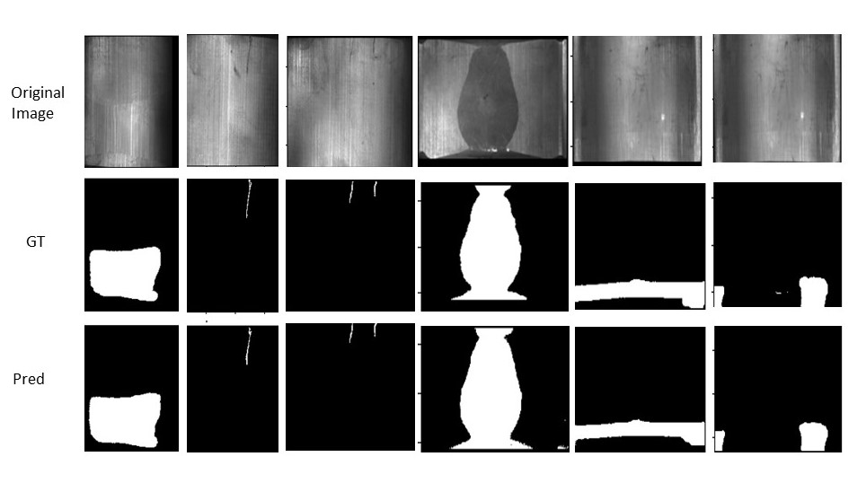

Pixel-level surface defect detection is critical in various industries, such as manufacturing, quality control, and product inspection. Detecting and classifying defects on surfaces is essential to ensure the production of high-quality products and prevent faulty or defective items from reaching the market.

In recent years, significant progress has been made in developing automated systems for surface defect detection. These systems utilize advanced computer vision techniques and machine learning algorithms to analyze images and identify defects at the pixel level.

One of the key challenges in pixel-level surface defect detection is distinguishing between normal variations in surface texture and actual defects. Surface defects can come in various forms, such as scratches, dents, cracks, or stains. These defects can be subtle and difficult to detect, especially when they occur on complex surfaces or have similar visual characteristics to the surrounding texture.

To address this challenge, researchers have developed sophisticated algorithms that leverage deep learning techniques, such as convolutional neural networks (CNNs). CNNs are capable of learning complex patterns and features from large datasets, making them ideal for surface defect detection tasks. By training the CNN on a diverse set of labelled images, it can learn to distinguish between normal and defective regions with high accuracy.

Another important aspect of pixel-level surface defect detection is real-time processing. In industries where high-speed production lines are common, it is crucial to have a system that can analyze images rapidly and provide immediate feedback. To achieve real-time processing, researchers have optimized algorithms and utilized parallel computing techniques to accelerate the defect detection process.

Furthermore, some studies have explored the use of multispectral imaging for surface defect detection. By capturing images at different wavelengths, these systems can reveal hidden defects that may not be visible in standard RGB images. Multispectral imaging can enhance the detection capabilities of surface defect detection systems, especially for defects that are challenging to perceive with the naked eye.

Overall, pixel-level surface defect detection plays a vital role in ensuring product quality and minimizing the risk of faulty items reaching consumers. With advancements in computer vision and machine learning techniques, automated defect detection systems are becoming more accurate, efficient, and capable of real-time processing. These systems have the potential to revolutionize quality control processes across various industries, leading to improved product quality and customer satisfaction.

- A sample of the Magnetic Tile defect dataset
  

